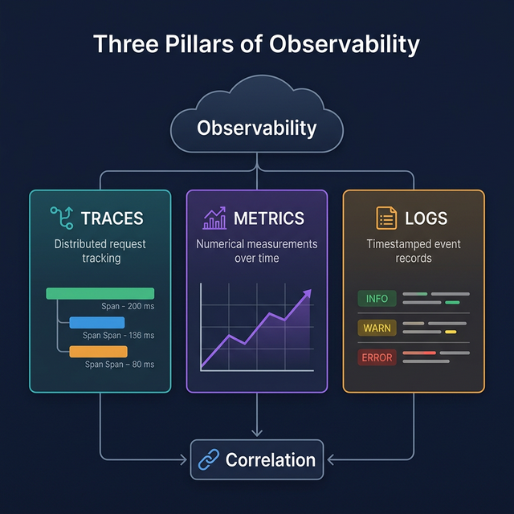

# 🔭 01. Observability 기초 (Observability Fundamentals)

## 학습 목표

Observability의 정의와 핵심 구성 요소(Traces, Metrics, Logs)를 이해하고, 기존 모니터링과의 차이점을 파악합니다.

---

## 핵심 개념

### Observability란 무엇인가?

Observability(관측 가능성)는 **시스템 외부에서 출력되는 데이터만으로 시스템 내부 상태를 파악할 수 있는 능력**을 의미합니다. 단순히 "서버가 살아 있는가?"를 넘어, "왜 이 요청이 느린가?", "어떤 서비스에서 병목이 발생하는가?"와 같은 질문에 답할 수 있어야 합니다.

### Monitoring vs. Observability

| 구분 | Monitoring | Observability |
|------|------------|---------------|
| 접근 방식 | 사전 정의된 지표를 감시 | 데이터를 기반으로 탐색·분석 |
| 질문 유형 | "CPU 사용률이 90% 이상인가?" (알려진 문제) | "왜 이 사용자 요청이 3초나 걸렸는가?" (미지의 문제) |
| 데이터 | 메트릭, 로그 위주 | Traces + Metrics + Logs 통합 |
| 적합한 환경 | 단일 서버, 단순한 아키텍처 | 분산 시스템, 마이크로서비스 |

Monitoring은 Observability의 일부입니다. Observability를 갖춘 시스템은 "예상하지 못한 문제"에 대해서도 데이터를 통해 원인을 추적할 수 있습니다.

### 왜 분산 시스템에서 Observability가 중요한가?

마이크로서비스 아키텍처에서 하나의 사용자 요청은 여러 서비스를 거쳐 처리됩니다.

```
사용자 요청
  → API Gateway
    → 인증 서비스
    → 주문 서비스
      → 결제 서비스
      → 재고 서비스
    → 알림 서비스
```

이 상황에서 "주문 API가 느리다"는 증상만으로는 원인을 특정하기 어렵습니다. 결제 서비스의 외부 API 호출이 느린 것인지, 재고 서비스의 데이터베이스 쿼리가 느린 것인지 파악하려면 **요청의 전체 흐름을 추적**할 수 있어야 합니다.

---

## Observability의 세 가지 신호 (Three Pillars)



### 1. Traces (분산 추적)

**정의**: 하나의 요청이 시스템을 통과하는 전체 경로를 기록한 것입니다.

- **Trace**: 요청의 전체 여정. 하나의 고유한 Trace ID로 식별됩니다.
- **Span**: Trace를 구성하는 개별 작업 단위. "주문 생성", "DB 조회", "결제 API 호출" 등이 각각 하나의 Span입니다.

```
Trace (trace_id: abc123)
├── Span: API Gateway (50ms)
│   ├── Span: 인증 검증 (5ms)
│   └── Span: 주문 처리 (40ms)
│       ├── Span: DB 조회 (10ms)
│       └── Span: 결제 API 호출 (25ms)  ← 병목 지점 발견
```

**어떤 문제를 해결하는가**: "이 요청이 느린 원인이 어디에 있는가?"에 답합니다.

### 2. Metrics (메트릭)

**정의**: 시간에 따른 수치 데이터의 집합입니다.

- **Counter**: 단조 증가하는 값 (예: 총 요청 수, 에러 수)
- **Histogram**: 값의 분포 (예: 응답 시간의 p50, p95, p99)
- **Gauge**: 특정 시점의 값 (예: 현재 CPU 사용률, 활성 연결 수)

```
http_requests_total{method="GET", status="200"} = 15234
http_request_duration_seconds{quantile="0.95"} = 0.45
system_cpu_usage = 0.72
```

**어떤 문제를 해결하는가**: "시스템의 전반적인 상태와 추세가 어떠한가?"에 답합니다. 알람 설정에도 사용됩니다.

### 3. Logs (로그)

**정의**: 특정 시점에 발생한 이벤트의 텍스트 기록입니다.

```
2024-03-15 10:23:45 [ERROR] PaymentService - 결제 실패: 카드 한도 초과
  user_id=user-42, order_id=order-789, amount=150000
```

**어떤 문제를 해결하는가**: "정확히 무슨 일이 일어났는가?"에 대한 상세한 맥락을 제공합니다.

### 세 가지 신호의 상관관계

세 신호는 독립적으로도 유용하지만, **서로 연결될 때** 가장 큰 가치를 발휘합니다:

```
[Metrics] 에러율 급등 감지
    ↓
[Traces] 에러가 발생한 요청의 흐름 추적 → 결제 서비스에서 실패 확인
    ↓
[Logs] 해당 Trace ID로 검색 → "외부 결제 API 타임아웃" 로그 확인
```

OpenTelemetry는 이 세 가지 신호를 **하나의 프레임워크로 통합**하여 생성, 수집, 내보내기를 표준화합니다.

---

## OpenTelemetry의 역할

### 벤더 중립적 표준

과거에는 Jaeger, Zipkin, Datadog, New Relic 등 각 벤더마다 자체적인 계측 방식과 데이터 형식을 사용했습니다. 이로 인해:

- 벤더를 변경하면 계측 코드를 전면 수정해야 했음
- 여러 도구를 병행 사용하면 중복 계측이 발생했음

OpenTelemetry(OTel)는 CNCF(Cloud Native Computing Foundation) 프로젝트로, **계측 표준을 통일**합니다. 애플리케이션 코드에서 OTel API로 텔레메트리 데이터를 생성하면, Exporter 설정만 변경하여 원하는 백엔드로 데이터를 보낼 수 있습니다.

```
애플리케이션 코드
    ↓ (OTel API/SDK로 계측)
OpenTelemetry Collector (수집·가공)
    ↓
┌──────────┬──────────┬──────────┐
│ Jaeger   │ Datadog  │ Grafana  │  ← 벤더 교체 시 설정만 변경
└──────────┴──────────┴──────────┘
```

### OTel이 하는 것과 하지 않는 것

| OTel이 하는 것 | OTel이 하지 않는 것 |
|---------------|-------------------|
| 텔레메트리 데이터 생성 (계측) | 데이터 저장 |
| 데이터 수집·가공 (Collector) | 시각화 대시보드 |
| 표준 형식으로 데이터 내보내기 | 알람/알림 |

저장, 시각화, 알람은 Jaeger, Prometheus, Grafana 등 별도의 백엔드 도구가 담당합니다.

---

## 실습: 세 가지 신호를 코드에서 확인

아래 코드는 세 가지 신호를 모두 포함하는 간단한 예시입니다. 아직 모든 내용을 이해할 필요는 없습니다. 전체 구조를 먼저 감을 잡는 것이 목적입니다.

`three_signals.py` 파일을 생성합니다:

```python
# three_signals.py
# Observability의 세 가지 신호 - Traces, Metrics, Logs

import logging

from opentelemetry import trace, metrics
from opentelemetry.sdk.trace import TracerProvider
from opentelemetry.sdk.trace.export import ConsoleSpanExporter, SimpleSpanProcessor
from opentelemetry.sdk.metrics import MeterProvider
from opentelemetry.sdk.metrics.export import (
    ConsoleMetricExporter,
    PeriodicExportingMetricReader,
)
from opentelemetry.sdk.resources import Resource

# --- 공통 Resource (서비스 식별 정보) ---
resource = Resource.create({
    "service.name": "demo-service",
    "service.version": "0.1.0",
})

# --- 1. Tracing 설정 ---
tracer_provider = TracerProvider(resource=resource)
tracer_provider.add_span_processor(SimpleSpanProcessor(ConsoleSpanExporter()))
trace.set_tracer_provider(tracer_provider)
tracer = trace.get_tracer(__name__)

# --- 2. Metrics 설정 ---
metric_reader = PeriodicExportingMetricReader(
    ConsoleMetricExporter(),
    export_interval_millis=5000,
)
meter_provider = MeterProvider(resource=resource, metric_readers=[metric_reader])
metrics.set_meter_provider(meter_provider)
meter = metrics.get_meter(__name__)

# 계측기 생성
request_counter = meter.create_counter(
    name="demo.request.count",
    description="처리된 요청 수",
)

# --- 3. Logging 설정 ---
logging.basicConfig(level=logging.INFO)
logger = logging.getLogger(__name__)

# --- 세 가지 신호를 함께 사용 ---
def process_order(order_id: str):
    # Trace: 주문 처리 흐름을 추적
    with tracer.start_as_current_span("process-order") as span:
        span.set_attribute("order.id", order_id)

        # Metric: 요청 수 증가
        request_counter.add(1, {"operation": "process_order"})

        # Log: 상세 이벤트 기록
        logger.info(f"주문 처리 시작: order_id={order_id}")

        # 비즈니스 로직 (시뮬레이션)
        validate_order(order_id)

        logger.info(f"주문 처리 완료: order_id={order_id}")


def validate_order(order_id: str):
    # 부모 Span(process-order) 아래에 자식 Span 생성
    with tracer.start_as_current_span("validate-order") as span:
        span.set_attribute("order.id", order_id)
        span.add_event("validation.passed")
        logger.info(f"주문 검증 통과: order_id={order_id}")


if __name__ == "__main__":
    process_order("ORD-001")
    process_order("ORD-002")

    # Provider 종료 (데이터 내보내기 완료 대기)
    tracer_provider.shutdown()
    meter_provider.shutdown()
```

실행:

```bash
poetry run python three_signals.py
```

출력에서 다음을 확인합니다:

- **Span 데이터**: `process-order`, `validate-order` Span이 부모-자식 관계로 출력됨
- **로그 메시지**: `주문 처리 시작`, `주문 검증 통과`, `주문 처리 완료` 순서로 출력됨
- **메트릭 데이터**: `demo.request.count`가 2로 기록됨 (5초 후 콘솔에 출력)

---

## 마무리

이번 단계에서 학습한 것:

- **Observability**: 시스템 외부 출력(Traces, Metrics, Logs)으로 내부 상태를 파악하는 능력
- **세 가지 신호**: 각각 "흐름 추적", "수치 추세", "상세 이벤트"라는 고유한 역할
- **OpenTelemetry의 위치**: 계측과 수집을 표준화하는 벤더 중립적 프레임워크

**다음 단계**: [02. OpenTelemetry 아키텍처](02-opentelemetry-architecture.md)에서 OTel의 내부 구조(API, SDK, Exporter, Collector)가 어떻게 구성되어 있고 서로 어떻게 연결되는지를 상세히 살펴봅니다.
