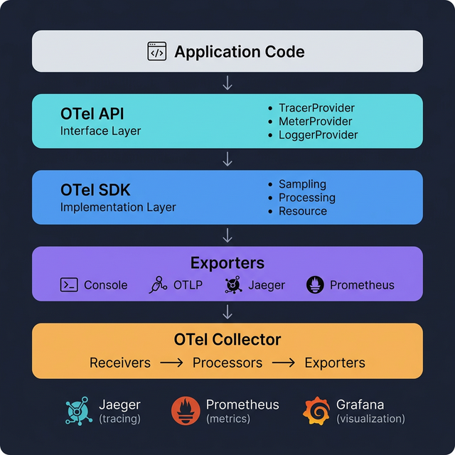

# 🏛️ 02. OpenTelemetry 아키텍처 (Architecture)

## 학습 목표

OpenTelemetry의 계층 구조(API → SDK → Exporter → Collector)를 이해하고, 각 구성 요소의 역할과 데이터 흐름을 파악합니다.

---

## 핵심 개념

### 전체 아키텍처 개요

OpenTelemetry는 텔레메트리 데이터의 **생성 → 처리 → 내보내기** 과정을 아래와 같은 계층으로 나누어 처리합니다.



```
┌─────────────────────────────────────────────────────┐
│                  애플리케이션 코드                      │
│   tracer.start_as_current_span("my-operation")      │
└─────────────────┬───────────────────────────────────┘
                  │ 호출
┌─────────────────▼───────────────────────────────────┐
│               OTel API (인터페이스 계층)                │
│   TracerProvider, MeterProvider, LoggerProvider      │
│   → 추상 인터페이스만 정의 (구현 없음)                   │
└─────────────────┬───────────────────────────────────┘
                  │ 구현
┌─────────────────▼───────────────────────────────────┐
│               OTel SDK (구현 계층)                     │
│   Span 생성, Sampling, Resource 관리, Processor       │
│   → 실제 데이터 수집·처리 로직                          │
└─────────────────┬───────────────────────────────────┘
                  │ 전달
┌─────────────────▼───────────────────────────────────┐
│               Exporter (내보내기 계층)                  │
│   Console, OTLP, Jaeger, Prometheus                 │
│   → 특정 형식/프로토콜로 데이터 전송                     │
└─────────────────┬───────────────────────────────────┘
                  │ (선택적)
┌─────────────────▼───────────────────────────────────┐
│           OTel Collector (수집·가공 서버)               │
│   Receiver → Processor → Exporter                   │
│   → 중앙 집중식 데이터 처리 및 라우팅                    │
└─────────────────┬───────────────────────────────────┘
                  │
         백엔드 (Jaeger, Prometheus, Grafana 등)
```

### 왜 이렇게 계층이 나뉘는가?

**관심사의 분리(Separation of Concerns)** 원칙을 따릅니다:

1. **라이브러리 개발자**는 API에만 의존하여 계측합니다. SDK 구현을 몰라도 됩니다.
2. **애플리케이션 개발자**는 SDK를 설정하여 어떤 데이터를, 어떻게, 어디에 보낼지 결정합니다.
3. **인프라 엔지니어**는 Collector를 통해 데이터 파이프라인을 중앙에서 관리합니다.

---

## 각 계층 상세

### 1. API 계층 (`opentelemetry-api`)

API 계층은 텔레메트리 데이터를 생성하기 위한 **인터페이스(추상 클래스)**만 제공합니다.

```python
from opentelemetry import trace

# get_tracer_provider()는 전역에 등록된 Provider를 반환
# SDK가 설정되지 않았으면 No-op(아무것도 하지 않는) 구현을 반환
tracer = trace.get_tracer("my-library", "1.0.0")

# SDK가 없어도 이 코드는 에러 없이 실행됨 (No-op)
with tracer.start_as_current_span("operation"):
    pass  # Span이 생성되지만 아무 데이터도 기록되지 않음
```

**핵심 특성:**
- **No-op 기본값**: SDK가 설치·설정되지 않아도 API 호출은 에러를 발생시키지 않습니다. 빈 동작(No-op)으로 실행됩니다.
- **경량**: 성능 오버헤드가 거의 없습니다.
- **안정적 인터페이스**: API의 변경은 매우 신중하게 이루어지므로, 이에 의존하는 라이브러리의 호환성이 유지됩니다.

**주요 인터페이스:**

| 인터페이스 | 역할 |
|-----------|------|
| `TracerProvider` | Tracer 인스턴스를 제공 |
| `Tracer` | Span을 생성 |
| `MeterProvider` | Meter 인스턴스를 제공 |
| `Meter` | 계측기(Counter, Histogram 등)를 생성 |
| `LoggerProvider` | Logger 인스턴스를 제공 |

### 2. SDK 계층 (`opentelemetry-sdk`)

SDK는 API 인터페이스의 **구체적인 구현체**입니다. 실제로 Span을 생성하고, 메트릭을 집계하며, 데이터를 Exporter로 전달합니다.

```python
from opentelemetry.sdk.trace import TracerProvider
from opentelemetry.sdk.trace.export import BatchSpanProcessor
from opentelemetry.sdk.resources import Resource

# Resource: 이 서비스에 대한 메타데이터
resource = Resource.create({
    "service.name": "order-service",
    "service.version": "2.0.0",
})

# TracerProvider: SDK의 핵심 진입점
provider = TracerProvider(resource=resource)
```

**SDK의 주요 구성 요소:**

| 구성 요소 | 역할 |
|----------|------|
| `Resource` | 텔레메트리를 생성하는 주체(서비스)에 대한 메타데이터 |
| `Sampler` | 어떤 Span을 수집하고 어떤 것을 건너뛸지 결정 |
| `SpanProcessor` | 생성된 Span을 처리 (배치 모아서 Exporter로 전달 등) |
| `MetricReader` | 메트릭 데이터를 주기적으로 읽어서 Exporter로 전달 |

### 3. Exporter 계층

Exporter는 SDK가 수집한 데이터를 **특정 형식으로 변환하여 외부 시스템으로 전송**합니다.

```python
from opentelemetry.sdk.trace.export import ConsoleSpanExporter, BatchSpanProcessor
from opentelemetry.exporter.otlp.proto.grpc.trace_exporter import OTLPSpanExporter

# 콘솔 출력 (개발/디버그용)
console_exporter = ConsoleSpanExporter()

# OTLP gRPC (Collector 또는 OTLP 호환 백엔드로 전송)
otlp_exporter = OTLPSpanExporter(endpoint="http://localhost:4317", insecure=True)

# Processor를 통해 Exporter에 연결
provider.add_span_processor(BatchSpanProcessor(otlp_exporter))
```

**주요 Exporter 종류:**

| Exporter | 대상 | 프로토콜 |
|----------|------|---------|
| `ConsoleSpanExporter` | 표준 출력 (디버그용) | 없음 |
| `OTLPSpanExporter` (gRPC) | OTel Collector, 호환 백엔드 | OTLP/gRPC |
| `OTLPSpanExporter` (HTTP) | OTel Collector, 호환 백엔드 | OTLP/HTTP |
| `PrometheusMetricReader` | Prometheus | Pull 방식 |

### 4. SpanProcessor: 배치 vs. 단순 처리

SpanProcessor는 생성된 Span을 Exporter로 전달하는 방식을 결정합니다.

```python
from opentelemetry.sdk.trace.export import (
    SimpleSpanProcessor,   # 즉시 내보내기
    BatchSpanProcessor,    # 배치로 모아서 내보내기
)

# SimpleSpanProcessor: Span 완료 즉시 Exporter로 전달
# → 개발/테스트 시 즉각적인 결과 확인에 적합
provider.add_span_processor(SimpleSpanProcessor(ConsoleSpanExporter()))

# BatchSpanProcessor: 일정량/시간 간격으로 모아서 전달
# → 운영 환경에 적합 (네트워크 호출 최소화, 성능 최적화)
provider.add_span_processor(BatchSpanProcessor(
    OTLPSpanExporter(endpoint="http://localhost:4317", insecure=True),
    max_queue_size=2048,           # 대기열 최대 크기
    schedule_delay_millis=5000,    # 내보내기 간격 (5초)
    max_export_batch_size=512,     # 한 번에 내보낼 최대 Span 수
))
```

### 5. Collector (별도 프로세스)

Collector는 애플리케이션과 독립적으로 동작하는 **텔레메트리 데이터 처리 서버**입니다. 필수는 아니지만, 운영 환경에서 다음과 같은 이점을 제공합니다:

- **중앙 집중 관리**: 여러 서비스의 데이터를 한 곳에서 수집·가공
- **애플리케이션 부담 경감**: 데이터 가공, 버퍼링, 재시도를 Collector가 담당
- **유연한 라우팅**: 하나의 데이터를 여러 백엔드로 동시에 전송 가능
- **데이터 가공**: 필터링, 속성 추가/제거, 샘플링 등

```
┌──────────┐  ┌──────────┐  ┌──────────┐
│Service A │  │Service B │  │Service C │  ← 각 서비스는 OTLP로 전송만
└────┬─────┘  └────┬─────┘  └────┬─────┘
     │             │             │
     └─────────────┼─────────────┘
                   │
            ┌──────▼──────┐
            │  Collector  │  ← 중앙에서 수집·가공·라우팅
            │  (Receiver  │
            │   → Proc.   │
            │   → Export) │
            └──────┬──────┘
                   │
         ┌─────────┼─────────┐
         │         │         │
    ┌────▼──┐ ┌───▼────┐ ┌──▼─────┐
    │Jaeger │ │Promethe│ │Grafana │
    │       │ │us      │ │Loki    │
    └───────┘ └────────┘ └────────┘
```

Collector의 아키텍처(Receiver → Processor → Exporter 파이프라인)는 [12. Collector 설정](12-collector-setup.md)에서 상세히 다룹니다.

---

## 데이터 흐름 전체 정리

### 직접 내보내기 (Collector 없이)

```
App → SDK(TracerProvider + BatchSpanProcessor) → Exporter → 백엔드(Jaeger 등)
```

- 구성이 단순함
- 소규모 서비스 또는 개발 환경에 적합

### Collector를 경유하는 내보내기 (권장)

```
App → SDK → OTLP Exporter → Collector → 백엔드(Jaeger, Prometheus 등)
```

- 운영 환경 권장
- 데이터 가공, 버퍼링, 멀티 백엔드 전송 가능

---

## 실습: 아키텍처 구성 요소를 코드로 확인

`architecture_demo.py` 파일을 생성합니다:

```python
# architecture_demo.py
# OTel 아키텍처의 각 계층을 코드에서 확인

from opentelemetry import trace
from opentelemetry.sdk.trace import TracerProvider
from opentelemetry.sdk.trace.export import (
    ConsoleSpanExporter,
    SimpleSpanProcessor,
    BatchSpanProcessor,
)
from opentelemetry.sdk.resources import Resource
from opentelemetry.sdk.trace.sampling import TraceIdRatioBased

# ① Resource: 서비스 식별 메타데이터
resource = Resource.create({
    "service.name": "architecture-demo",
    "service.version": "1.0.0",
    "deployment.environment": "development",
})

# ② Sampler: 수집 비율 결정 (여기서는 100%)
sampler = TraceIdRatioBased(1.0)

# ③ TracerProvider: SDK의 중심 객체
provider = TracerProvider(
    resource=resource,
    sampler=sampler,
)

# ④ SpanProcessor + Exporter: 데이터 처리 및 내보내기
# 개발용으로 SimpleSpanProcessor + ConsoleSpanExporter 사용
processor = SimpleSpanProcessor(ConsoleSpanExporter())
provider.add_span_processor(processor)

# ⑤ 글로벌 등록: API 계층에서 이 Provider를 사용하도록 연결
trace.set_tracer_provider(provider)

# ⑥ Tracer 취득: 계측 단위별로 Tracer를 생성
tracer = trace.get_tracer(
    instrumenting_module_name=__name__,   # 계측 모듈 식별자
    instrumenting_library_version="1.0.0", # 모듈 버전
)

# ⑦ Span 생성: 실제 텔레메트리 데이터 생성
with tracer.start_as_current_span("main-operation") as parent:
    parent.set_attribute("component", "architecture-demo")

    with tracer.start_as_current_span("sub-operation") as child:
        child.set_attribute("step", "data-processing")
        child.add_event("processing.started", {"items.count": 42})

        # 비즈니스 로직 자리
        result = sum(range(100))

        child.add_event("processing.completed", {"result": result})

print("\n--- 아키텍처 구성 요소 요약 ---")
print(f"Resource:   {resource.attributes}")
print(f"Sampler:    {sampler.__class__.__name__} (rate=1.0)")
print(f"Processor:  {processor.__class__.__name__}")
print(f"Exporter:   ConsoleSpanExporter")

# Provider 종료
provider.shutdown()
```

실행:

```bash
poetry run python architecture_demo.py
```

출력에서 확인할 내용:

1. **Resource 속성**이 Span 데이터에 포함되어 있는지 (`service.name`, `deployment.environment`)
2. **부모-자식 Span 관계**: `main-operation` → `sub-operation`
3. **이벤트**: `processing.started`, `processing.completed` 이벤트 기록

---

## API vs. SDK: No-op 동작 확인

SDK를 설정하지 않으면 API는 No-op으로 동작합니다. 이를 직접 확인해 봅니다.

`noop_demo.py` 파일을 생성합니다:

```python
# noop_demo.py
# SDK를 설정하지 않은 상태에서 API 호출

from opentelemetry import trace

# SDK TracerProvider를 설정하지 않음
# → API가 제공하는 기본 No-op Provider가 사용됨

tracer = trace.get_tracer("noop-test")

with tracer.start_as_current_span("test-span") as span:
    # Span이 생성되지만 아무 데이터도 기록되지 않음
    span.set_attribute("key", "value")
    print(f"Span is recording: {span.is_recording()}")  # False
    print("API는 에러 없이 정상 실행됩니다.")

print("✅ SDK 없이도 API 호출이 안전하게 동작함을 확인했습니다.")
```

```bash
poetry run python noop_demo.py
```

`is_recording()`이 `False`를 반환하는 것을 확인할 수 있습니다. SDK가 없으면 Span 데이터가 실제로 기록되진 않지만 코드는 에러 없이 동작합니다.

---

## 마무리

이번 단계에서 학습한 것:

- **4계층 구조**: API(인터페이스) → SDK(구현) → Exporter(내보내기) → Collector(중앙 처리)
- **API와 SDK의 분리**: 라이브러리는 API에만 의존, 애플리케이션에서 SDK를 설정
- **No-op 안전성**: SDK 미설정 시에도 API 호출은 에러를 발생시키지 않음
- **직접 내보내기 / Collector 경유**: 환경에 따른 두 가지 배포 패턴

**다음 단계**: [03. Traces 기초](03-traces-basics.md)에서 TracerProvider를 직접 설정하고, 첫 번째 Span을 생성하여 콘솔에 출력하는 실습을 진행합니다.
