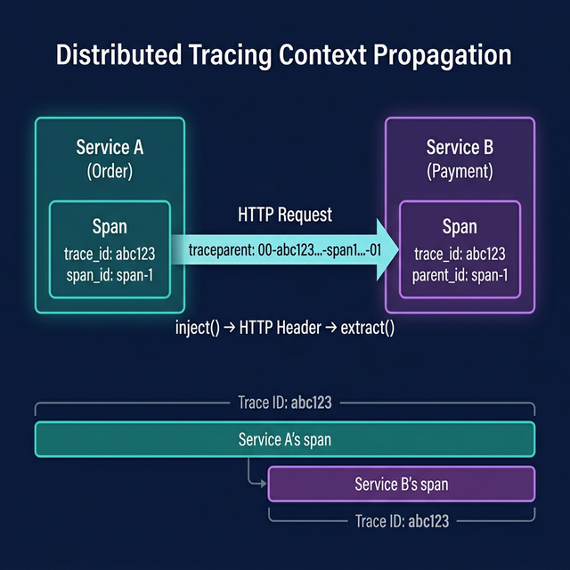

# 🔀 05. Context Propagation

## 학습 목표

분산 시스템에서 서비스 간에 Trace를 연결하는 Context Propagation의 원리를 이해하고, W3C TraceContext 표준을 실습합니다.

---

## 핵심 개념



### Context란?

Context는 현재 실행 중인 Span 정보를 담고 있는 **불변 객체**입니다. 함수 호출이나 비동기 작업에서 "지금 어떤 Trace/Span 안에 있는가?"를 추적합니다.

```
Service A                          Service B
┌────────────────────┐            ┌────────────────────┐
│ Span: order-create │            │ Span: payment-check│
│ trace_id: abc123   │ ──HTTP──→  │ trace_id: abc123   │
│ span_id: span-1    │            │ parent_id: span-1  │
└────────────────────┘            └────────────────────┘
       │                                   │
       └──── 같은 trace_id를 공유 ──────────┘
```

- Service A에서 HTTP 요청을 보낼 때, **현재 Span의 trace_id와 span_id를 HTTP 헤더에 포함**시킵니다.
- Service B가 해당 헤더를 파싱하여 자신의 Span에 부모 정보로 설정합니다.
- 결과적으로 두 서비스의 Span이 하나의 Trace로 연결됩니다.

### Propagation의 두 단계

1. **Inject (주입)**: 발신 측에서 현재 Context를 전송 매체(HTTP 헤더, 메시지 헤더 등)에 기록
2. **Extract (추출)**: 수신 측에서 전송 매체에서 Context를 읽어 복원

### W3C TraceContext 헤더

OpenTelemetry는 기본적으로 W3C TraceContext 표준을 사용합니다. 두 개의 HTTP 헤더가 관여합니다:

```
traceparent: 00-<trace_id>-<parent_span_id>-<trace_flags>
             │    │              │              │
             │    │              │              └── 01 = 샘플링됨, 00 = 샘플링 안됨
             │    │              └──────────────── 부모 Span ID (16 hex, 8바이트)
             │    └─────────────────────────────── Trace ID (32 hex, 16바이트)
             └──────────────────────────────────── 버전 (항상 "00")

tracestate: vendor1=value1,vendor2=value2
            └── 벤더별 추가 정보 (선택 사항)
```

실제 예시:
```
traceparent: 00-4bf92f3577b34da6a3ce929d0e0e4736-00f067aa0ba902b7-01
tracestate: congo=t61rcWkgMzE
```

---

## 실습

### 1단계: 수동 Inject/Extract 이해

실제 HTTP 통신 없이 Inject와 Extract의 동작을 확인합니다.

`context_manual.py` 파일을 생성합니다:

```python
# context_manual.py
# Context의 Inject/Extract를 수동으로 실습

from opentelemetry import trace, context
from opentelemetry.propagate import inject, extract
from opentelemetry.sdk.trace import TracerProvider
from opentelemetry.sdk.trace.export import ConsoleSpanExporter, SimpleSpanProcessor
from opentelemetry.sdk.resources import Resource

resource = Resource.create({"service.name": "context-demo"})
provider = TracerProvider(resource=resource)
provider.add_span_processor(SimpleSpanProcessor(ConsoleSpanExporter()))
trace.set_tracer_provider(provider)

tracer = trace.get_tracer(__name__)


def service_a():
    """발신 측: Context를 HTTP 헤더에 주입"""
    with tracer.start_as_current_span("service-a-operation") as span:
        print(f"[Service A] Trace ID: {span.get_span_context().trace_id:#034x}")
        print(f"[Service A] Span ID:  {span.get_span_context().span_id:#018x}")

        # HTTP 헤더 역할을 하는 딕셔너리
        headers = {}

        # 현재 Context를 headers에 주입
        # → traceparent, tracestate 헤더가 자동 생성됨
        inject(headers)

        print(f"[Service A] 주입된 헤더: {headers}")

        # 이 headers를 HTTP 요청에 포함시켜 Service B로 전송한다고 가정
        service_b(headers)


def service_b(incoming_headers: dict):
    """수신 측: HTTP 헤더에서 Context를 추출"""
    print(f"\n[Service B] 수신된 헤더: {incoming_headers}")

    # 수신된 헤더에서 Context 추출
    extracted_ctx = extract(carrier=incoming_headers)

    # 추출된 Context를 사용하여 새 Span 생성
    # → 이 Span은 Service A의 Span을 부모로 가짐
    with tracer.start_as_current_span(
        "service-b-operation",
        context=extracted_ctx,
    ) as span:
        print(f"[Service B] Trace ID: {span.get_span_context().trace_id:#034x}")
        print(f"[Service B] Span ID:  {span.get_span_context().span_id:#018x}")
        # Trace ID가 Service A와 동일한지 확인


service_a()
provider.shutdown()
```

```bash
poetry run python context_manual.py
```

출력에서 확인할 것:
- `traceparent` 헤더가 자동 생성됨
- Service A와 Service B의 Trace ID가 동일함
- Service B의 Span이 Service A의 Span을 부모로 가짐

### 2단계: Flask 서비스 간 Context 전파

두 개의 Flask 서비스를 만들어 실제 HTTP 통신에서의 Context 전파를 확인합니다.

패키지를 추가합니다:

```bash
poetry add flask requests
```

**Service A** (`service_a_app.py`):

```python
# service_a_app.py
# Service A: 사용자 요청을 받아 Service B를 호출

import requests
from flask import Flask, jsonify
from opentelemetry import trace
from opentelemetry.propagate import inject
from opentelemetry.sdk.trace import TracerProvider
from opentelemetry.sdk.trace.export import ConsoleSpanExporter, SimpleSpanProcessor
from opentelemetry.sdk.resources import Resource

# OTel 설정
resource = Resource.create({"service.name": "service-a"})
provider = TracerProvider(resource=resource)
provider.add_span_processor(SimpleSpanProcessor(ConsoleSpanExporter()))
trace.set_tracer_provider(provider)
tracer = trace.get_tracer(__name__)

app = Flask(__name__)


@app.route("/orders")
def get_orders():
    with tracer.start_as_current_span("GET /orders", kind=trace.SpanKind.SERVER):
        # Service B로 요청 전송 시 Context 주입
        headers = {}
        inject(headers)  # traceparent 헤더 자동 추가

        # Service B 호출
        response = requests.get(
            "http://localhost:5001/inventory",
            headers=headers,
        )

        return jsonify({
            "orders": [{"id": 1, "item": "widget"}],
            "inventory_status": response.json(),
        })


if __name__ == "__main__":
    app.run(port=5000, debug=False)
```

**Service B** (`service_b_app.py`):

```python
# service_b_app.py
# Service B: Service A로부터 호출을 받아 처리

from flask import Flask, request, jsonify
from opentelemetry import trace
from opentelemetry.propagate import extract
from opentelemetry.sdk.trace import TracerProvider
from opentelemetry.sdk.trace.export import ConsoleSpanExporter, SimpleSpanProcessor
from opentelemetry.sdk.resources import Resource

# OTel 설정
resource = Resource.create({"service.name": "service-b"})
provider = TracerProvider(resource=resource)
provider.add_span_processor(SimpleSpanProcessor(ConsoleSpanExporter()))
trace.set_tracer_provider(provider)
tracer = trace.get_tracer(__name__)

app = Flask(__name__)


@app.route("/inventory")
def get_inventory():
    # 수신된 HTTP 헤더에서 Context 추출
    ctx = extract(carrier=request.headers)

    # 추출된 Context로 Span 생성 → Service A의 Span과 같은 Trace에 연결
    with tracer.start_as_current_span(
        "GET /inventory",
        context=ctx,
        kind=trace.SpanKind.SERVER,
    ) as span:
        span.set_attribute("inventory.warehouse", "warehouse-1")

        inventory = {"item": "widget", "quantity": 150}
        return jsonify(inventory)


if __name__ == "__main__":
    app.run(port=5001, debug=False)
```

실행 방법:
```bash
# 터미널 1: Service B 실행
poetry run python service_b_app.py

# 터미널 2: Service A 실행
poetry run python service_a_app.py

# 터미널 3: 요청 전송
curl http://localhost:5000/orders
```

양쪽 서비스의 콘솔 출력에서 **동일한 `trace_id`**를 확인합니다.

### 3단계: 자동 계측에서의 Context 전파

09장에서 다루는 자동 계측을 사용하면, Inject/Extract를 직접 작성할 필요가 없습니다. Flask와 requests 라이브러리의 자동 계측이 이를 처리합니다:

```python
# 자동 계측 사용 시
# → Flask: 요청 수신 시 자동으로 extract + Span 생성
# → requests: 요청 전송 시 자동으로 inject
# 개발자는 비즈니스 로직의 커스텀 Span만 추가하면 됨
```

---

## Context 전파의 내부 동작

### Python Context API

```python
from opentelemetry import context

# 현재 Context 가져오기
current_ctx = context.get_current()

# Context에 값 설정 (불변 — 새 Context 반환)
new_ctx = context.set_value("my-key", "my-value", current_ctx)

# Context 활성화 (이후 코드에서 이 Context가 "현재"가 됨)
token = context.attach(new_ctx)

# 이후 코드에서 get_current()를 호출하면 new_ctx가 반환됨
active_ctx = context.get_current()

# Context 복원 (이전 Context로 되돌리기)
context.detach(token)
```

`start_as_current_span()`은 내부적으로 이 과정을 자동화합니다:
1. 새 Span을 생성
2. 그 Span을 현재 Context에 넣고 attach
3. `with` 블록 종료 시 Span을 끝내고 이전 Context를 detach

### 비동기 작업에서의 Context

```python
import asyncio
from opentelemetry import context, trace

tracer = trace.get_tracer(__name__)

async def process_async():
    with tracer.start_as_current_span("parent"):
        # asyncio.create_task는 Context를 자동으로 복사함 (Python 3.12+)
        task = asyncio.create_task(child_operation())
        await task

async def child_operation():
    # 부모의 Context가 전파되어 동일 Trace에 연결됨
    with tracer.start_as_current_span("child-async"):
        await asyncio.sleep(0.1)
```

---

## 지원되는 Propagation 형식

| 형식 | 헤더 | 설명 |
|------|------|------|
| W3C TraceContext | `traceparent`, `tracestate` | OTel 기본값, 업계 표준 |
| B3 (Zipkin) | `X-B3-TraceId` 등 | Zipkin 호환 |
| B3 Multi | 개별 헤더 | B3의 멀티 헤더 버전 |
| Jaeger | `uber-trace-id` | Jaeger 네이티브 |

여러 형식을 동시에 지원하려면:

```python
from opentelemetry.propagate import set_global_textmap
from opentelemetry.propagators.composite import CompositeTextMapPropagator
from opentelemetry.propagators.b3 import B3MultiFormat
from opentelemetry.trace.propagation import TraceContextTextMapPropagator

set_global_textmap(CompositeTextMapPropagator([
    TraceContextTextMapPropagator(),  # W3C (기본)
    B3MultiFormat(),                  # Zipkin B3 호환
]))
```

---

## 마무리

이번 단계에서 학습한 것:

- **Context**: 현재 Span 정보를 담는 불변 객체
- **Inject/Extract**: 발신 측에서 Context를 주입, 수신 측에서 추출
- **W3C TraceContext**: `traceparent`, `tracestate` 헤더를 통한 표준 전파
- **실제 HTTP 통신**: Flask 서비스 간 Context 전파 실습

**다음 단계**: [06. Metrics 기초](06-metrics-basics.md)에서 두 번째 신호인 Metrics(메트릭)를 다루며, MeterProvider, Counter, Histogram의 기본 사용법을 살펴봅니다.
