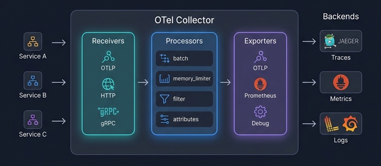

# 🏗️ 12. Collector 설정 (Collector Setup)

## 학습 목표

OpenTelemetry Collector의 아키텍처를 이해하고, Docker로 Collector를 구동하여 애플리케이션의 텔레메트리 데이터를 수신하는 환경을 구축합니다.

---

## 핵심 개념



### Collector란?

OpenTelemetry Collector는 텔레메트리 데이터를 **수신, 처리, 내보내기**하는 독립 프로세스입니다. 애플리케이션과 백엔드(Jaeger, Prometheus 등) 사이에 위치하여 중앙 집중식 데이터 처리를 담당합니다.

### 왜 Collector를 사용하는가?

애플리케이션에서 직접 백엔드로 전송하는 방식과 비교했을 때:

| 항목 | 직접 전송 | Collector 경유 |
|------|----------|---------------|
| 백엔드 변경 | 앱 코드/설정 수정 필요 | Collector 설정만 변경 |
| 데이터 가공 | 앱에서 처리 (부하 증가) | Collector가 담당 |
| 버퍼링/재시도 | 앱에서 관리 | Collector가 담당 |
| 멀티 백엔드 | Exporter 여러 개 추가 | Collector에서 라우팅 |
| 배포 복잡도 | 단순 | 별도 프로세스 필요 |

운영 환경에서는 Collector 사용이 **권장**됩니다.

### Collector 배포 모드

```
1. Agent 모드: 각 호스트/Pod에 사이드카로 배포
   ┌─────────┬──────────┐
   │ App     │ Collector│ ← 같은 호스트/Pod
   └─────────┴────┬─────┘
                  │
            중앙 Collector 또는 백엔드

2. Gateway 모드: 중앙 집중식 단일 인스턴스
   ┌──────┐ ┌──────┐ ┌──────┐
   │App A │ │App B │ │App C │
   └──┬───┘ └──┬───┘ └──┬───┘
      └────────┼────────┘
               │
         ┌─────▼─────┐
         │ Collector  │ ← Gateway
         └─────┬─────┘
               │
          백엔드들
```

### Collector 배포판

| 배포판 | 포함 범위 | 사용 시점 |
|--------|----------|----------|
| `otel/opentelemetry-collector` | 핵심 컴포넌트만 | 최소한의 기능만 필요 시 |
| `otel/opentelemetry-collector-contrib` | 핵심 + 커뮤니티 컴포넌트 | 다양한 Receiver/Exporter 필요 시 (권장) |

---

## 실습

### 1단계: 최소 Collector 설정

`otel-collector-config.yml` 파일을 생성합니다:

```yaml
# otel-collector-config.yml
# OpenTelemetry Collector 최소 설정

# --- Receivers: 데이터 수신 ---
receivers:
  # OTLP Receiver: gRPC와 HTTP 프로토콜로 데이터 수신
  otlp:
    protocols:
      grpc:
        endpoint: 0.0.0.0:4317
      http:
        endpoint: 0.0.0.0:4318

# --- Processors: 데이터 가공 ---
processors:
  # Batch Processor: 데이터를 모아서 일괄 전송 (성능 최적화)
  batch:
    timeout: 5s              # 최대 5초 대기 후 전송
    send_batch_size: 1024     # 최대 1024개 아이템 모아서 전송

# --- Exporters: 데이터 내보내기 ---
exporters:
  # Debug Exporter: 로그로 데이터 출력 (개발용)
  debug:
    verbosity: detailed

# --- Service: 파이프라인 연결 ---
service:
  pipelines:
    # Traces 파이프라인
    traces:
      receivers: [otlp]
      processors: [batch]
      exporters: [debug]

    # Metrics 파이프라인
    metrics:
      receivers: [otlp]
      processors: [batch]
      exporters: [debug]

    # Logs 파이프라인
    logs:
      receivers: [otlp]
      processors: [batch]
      exporters: [debug]
```

### 2단계: Docker로 Collector 실행

```bash
docker run -d --name otel-collector \
  -p 4317:4317 \
  -p 4318:4318 \
  -v $(pwd)/otel-collector-config.yml:/etc/otelcol-contrib/config.yaml \
  otel/opentelemetry-collector-contrib:latest
```

로그 확인:

```bash
docker logs -f otel-collector
```

`Everything is ready` 메시지가 출력되면 Collector가 정상적으로 시작된 것입니다.

### 3단계: 앱 → Collector → 콘솔 확인

```python
# app_with_collector.py
# Collector로 데이터를 전송하는 앱

import time
from opentelemetry import trace
from opentelemetry.sdk.trace import TracerProvider
from opentelemetry.sdk.trace.export import BatchSpanProcessor
from opentelemetry.sdk.resources import Resource
from opentelemetry.exporter.otlp.proto.grpc.trace_exporter import OTLPSpanExporter

resource = Resource.create({
    "service.name": "collector-test-app",
    "deployment.environment": "development",
})

provider = TracerProvider(resource=resource)

# Collector의 OTLP gRPC 엔드포인트로 전송
provider.add_span_processor(
    BatchSpanProcessor(OTLPSpanExporter(
        endpoint="http://localhost:4317",
        insecure=True,
    ))
)
trace.set_tracer_provider(provider)

tracer = trace.get_tracer(__name__)

# 테스트 데이터 생성
with tracer.start_as_current_span("test-collector") as span:
    span.set_attribute("test.iteration", 1)
    with tracer.start_as_current_span("child-operation"):
        time.sleep(0.01)
    print("✅ Collector로 데이터 전송 완료")

provider.shutdown()
```

```bash
poetry run python app_with_collector.py
```

Collector 로그(`docker logs otel-collector`)에서 수신된 Span 데이터를 확인합니다.

### 4단계: Docker Compose로 전체 스택 구성

`docker-compose.yml` 파일을 생성합니다:

```yaml
# docker-compose.yml
# Collector + Jaeger + Prometheus 통합 환경

services:
  # OpenTelemetry Collector
  otel-collector:
    image: otel/opentelemetry-collector-contrib:latest
    volumes:
      - ./otel-collector-config-full.yml:/etc/otelcol-contrib/config.yaml
    ports:
      - "4317:4317"   # OTLP gRPC
      - "4318:4318"   # OTLP HTTP
      - "8889:8889"   # Prometheus metrics (Collector 자체 메트릭)
    depends_on:
      - jaeger

  # Jaeger (Traces 백엔드)
  jaeger:
    image: jaegertracing/all-in-one:latest
    ports:
      - "16686:16686"  # Jaeger UI
      - "4317"         # OTLP gRPC (내부용)

  # Prometheus (Metrics 백엔드)
  prometheus:
    image: prom/prometheus:latest
    volumes:
      - ./prometheus.yml:/etc/prometheus/prometheus.yml
    ports:
      - "9090:9090"
```

`otel-collector-config-full.yml`:

```yaml
# otel-collector-config-full.yml
# Collector → Jaeger + Prometheus 라우팅

receivers:
  otlp:
    protocols:
      grpc:
        endpoint: 0.0.0.0:4317
      http:
        endpoint: 0.0.0.0:4318

processors:
  batch:
    timeout: 5s
    send_batch_size: 1024

exporters:
  debug:
    verbosity: basic

  # Jaeger로 Traces 전송
  otlp/jaeger:
    endpoint: jaeger:4317
    tls:
      insecure: true

  # Prometheus용 메트릭 엔드포인트 노출
  prometheus:
    endpoint: 0.0.0.0:8889

service:
  pipelines:
    traces:
      receivers: [otlp]
      processors: [batch]
      exporters: [debug, otlp/jaeger]

    metrics:
      receivers: [otlp]
      processors: [batch]
      exporters: [debug, prometheus]

    logs:
      receivers: [otlp]
      processors: [batch]
      exporters: [debug]
```

`prometheus.yml`:

```yaml
global:
  scrape_interval: 15s

scrape_configs:
  - job_name: 'otel-collector'
    static_configs:
      - targets: ['otel-collector:8889']
```

실행:

```bash
docker compose up -d
```

확인:
- Jaeger UI: http://localhost:16686
- Prometheus UI: http://localhost:9090

---

## 정리

```bash
docker compose down
# 또는 단일 컨테이너:
docker stop otel-collector && docker rm otel-collector
```

---

## 마무리

이번 단계에서 학습한 것:

- Collector의 아키텍처와 배포 모드 (Agent, Gateway)
- YAML 설정 파일 구조: Receivers → Processors → Exporters → Service
- Docker/Docker Compose로 Collector + Jaeger + Prometheus 통합 환경 구성
- 앱에서 Collector로 OTLP 전송 확인

**다음 단계**: [13. Collector 파이프라인](13-collector-pipelines.md)에서 다양한 Processor를 활용하여 데이터 필터링, 변환, 속성 관리 등 고급 파이프라인 구성을 학습합니다.
