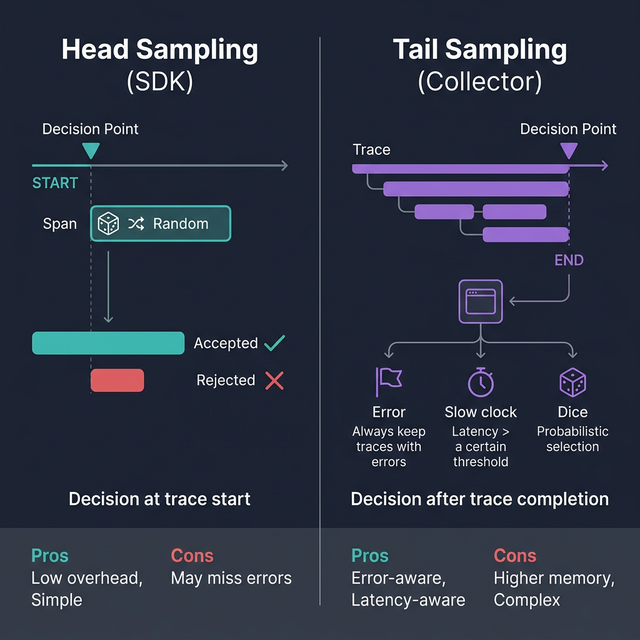

# 🎯 14. Sampling 전략 (Sampling Strategies)

## 학습 목표

트래픽 규모에 따라 수집 데이터량을 제어하는 다양한 샘플링 전략(Head Sampling, Tail Sampling)의 원리와 설정 방법을 학습합니다.

---

## 핵심 개념

### 왜 샘플링이 필요한가?

운영 환경에서 모든 요청의 Trace를 100% 수집하면:

- **저장 비용** 증가 (Jaeger, Elasticsearch 등의 디스크 사용)
- **네트워크 부하** 증가 (앱 → Collector → 백엔드)
- **백엔드 성능** 저하

예를 들어 초당 10,000 요청을 처리하는 서비스에서 요청당 평균 5개 Span이 생성되면, 하루에 약 43억 개의 Span이 발생합니다. 이를 모두 저장하는 것은 비현실적입니다.

샘플링을 통해 **대표적인 데이터만 수집**하면서도 시스템의 동작을 충분히 파악할 수 있습니다.

### Head Sampling vs. Tail Sampling



| 항목 | Head Sampling | Tail Sampling |
|------|---------------|---------------|
| 결정 시점 | Trace 시작 시 (첫 Span 생성 시) | Trace 완료 후 |
| 구현 위치 | SDK (앱 내부) | Collector |
| 장점 | 단순, 오버헤드 낮음 | 결과 기반 샘플링 가능 |
| 단점 | 에러 Trace를 놓칠 수 있음 | 메모리 사용 높음, 복잡 |

---

## Head Sampling (SDK 레벨)

### AlwaysOn / AlwaysOff

```python
from opentelemetry.sdk.trace.sampling import ALWAYS_ON, ALWAYS_OFF
from opentelemetry.sdk.trace import TracerProvider

# 모든 Span 수집 (기본값)
provider = TracerProvider(sampler=ALWAYS_ON)

# 모든 Span 무시 (테스트용)
provider = TracerProvider(sampler=ALWAYS_OFF)
```

### TraceIdRatioBased

Trace ID의 해시값을 기준으로 확률적으로 샘플링합니다.

```python
from opentelemetry.sdk.trace.sampling import TraceIdRatioBased

# 10%의 Trace만 수집
sampler = TraceIdRatioBased(0.1)
provider = TracerProvider(sampler=sampler)
```

**특성**:
- 동일한 Trace ID는 항상 같은 샘플링 결정을 받음 (결정적)
- 서비스 간에 같은 비율을 설정하면 완전한 Trace가 유지됨

### ParentBased

부모 Span의 샘플링 결정을 자식 Span이 따르도록 합니다. 분산 시스템에서 Trace의 일관성을 유지하는 데 중요합니다.

```python
from opentelemetry.sdk.trace.sampling import ParentBased, TraceIdRatioBased

# 부모가 있으면 부모의 결정을 따름
# 부모가 없으면(루트 Span) 20% 비율로 샘플링
sampler = ParentBased(root=TraceIdRatioBased(0.2))
provider = TracerProvider(sampler=sampler)
```

동작 규칙:

```
1. 부모 Span이 샘플링됨 (sampled=1) → 자식도 샘플링
2. 부모 Span이 샘플링 안됨 (sampled=0) → 자식도 샘플링 안됨
3. 부모가 없음 (루트 Span) → root 인자의 Sampler로 결정
4. 원격 부모 (다른 서비스에서 전파) → remote_parent_sampled/not_sampled로 결정
```

### 환경 변수로 설정

```bash
# TraceIdRatioBased 10%
export OTEL_TRACES_SAMPLER=traceidratio
export OTEL_TRACES_SAMPLER_ARG=0.1

# ParentBased + TraceIdRatio
export OTEL_TRACES_SAMPLER=parentbased_traceidratio
export OTEL_TRACES_SAMPLER_ARG=0.1

# Always On
export OTEL_TRACES_SAMPLER=always_on
```

### 실습: Head Sampling 비교

```python
# sampling_head.py
# 여러 Head Sampling 전략 비교

from opentelemetry import trace
from opentelemetry.sdk.trace import TracerProvider
from opentelemetry.sdk.trace.export import (
    SimpleSpanProcessor,
    ConsoleSpanExporter,
)
from opentelemetry.sdk.trace.sampling import (
    ALWAYS_ON,
    TraceIdRatioBased,
    ParentBased,
)
from opentelemetry.sdk.resources import Resource


def test_sampler(sampler, sampler_name: str, iterations: int = 100):
    """주어진 Sampler로 여러 Span을 생성하고 수집 비율 확인"""
    resource = Resource.create({"service.name": f"sampling-{sampler_name}"})
    provider = TracerProvider(resource=resource, sampler=sampler)
    # ConsoleExporter를 연결하지 않아 출력을 최소화
    trace.set_tracer_provider(provider)
    tracer = trace.get_tracer(__name__)

    sampled_count = 0
    for i in range(iterations):
        with tracer.start_as_current_span(f"test-{i}") as span:
            if span.is_recording():
                sampled_count += 1

    print(f"[{sampler_name}] {iterations}회 중 {sampled_count}회 수집 "
          f"({sampled_count / iterations * 100:.1f}%)")
    provider.shutdown()


# 100% 수집
test_sampler(ALWAYS_ON, "always-on", 1000)

# 10% 수집
test_sampler(TraceIdRatioBased(0.1), "ratio-10%", 1000)

# 50% 수집
test_sampler(TraceIdRatioBased(0.5), "ratio-50%", 1000)

# ParentBased + 20% root
test_sampler(
    ParentBased(root=TraceIdRatioBased(0.2)),
    "parent-based-20%",
    1000,
)
```

```bash
poetry run python sampling_head.py
```

---

## Tail Sampling (Collector 레벨)

Tail Sampling은 Trace가 끝난 후 **Trace 전체의 정보**를 기반으로 수집 여부를 결정합니다. Collector의 `tail_sampling` Processor로 구현합니다.

### 장점

- **에러 Trace 보장**: 상태 코드가 ERROR인 Trace는 무조건 수집
- **느린 요청 포착**: 응답 시간이 임계값을 초과하는 Trace만 수집
- **조건 기반**: 특정 속성, 서비스명, Span 이름 등 다양한 조건 조합

### Tail Sampling 설정

```yaml
# otel-collector-tail-sampling.yml

receivers:
  otlp:
    protocols:
      grpc:
        endpoint: 0.0.0.0:4317

processors:
  # Tail Sampling Processor
  tail_sampling:
    # Trace를 완성하기 위해 대기하는 시간
    decision_wait: 10s
    # 메모리에 보관할 최대 Trace 수
    num_traces: 50000
    # 결정이 내려진 후 Span을 얼마나 더 수집할지
    expected_new_traces_per_sec: 100

    policies:
      # 정책 1: 에러가 포함된 Trace는 100% 수집
      - name: error-policy
        type: status_code
        status_code:
          status_codes:
            - ERROR

      # 정책 2: 1초 이상 걸린 Trace 수집
      - name: latency-policy
        type: latency
        latency:
          threshold_ms: 1000

      # 정책 3: 나머지는 10%만 수집
      - name: probabilistic-policy
        type: probabilistic
        probabilistic:
          sampling_percentage: 10

      # 정책 4: 특정 서비스의 Trace는 항상 수집
      - name: critical-service-policy
        type: string_attribute
        string_attribute:
          key: service.name
          values:
            - payment-service
            - auth-service

  batch:
    timeout: 5s

exporters:
  otlp/jaeger:
    endpoint: jaeger:4317
    tls:
      insecure: true
  debug:
    verbosity: basic

service:
  pipelines:
    traces:
      receivers: [otlp]
      processors: [tail_sampling, batch]
      exporters: [otlp/jaeger, debug]
```

### Tail Sampling 주의사항

1. **메모리 사용**: 결정 대기 중인 Trace를 메모리에 보관하므로 메모리 사용량이 높음
2. **Collector 확장**: 같은 Trace의 모든 Span이 동일한 Collector 인스턴스에 도착해야 올바른 결정이 가능 → Load Balancer에서 Trace ID 기반 라우팅 필요
3. **결정 지연**: `decision_wait` 시간만큼 데이터 전달이 지연됨

---

## 샘플링 전략 선택 가이드

| 상황 | 권장 전략 |
|------|----------|
| 개발/테스트 환경 | `ALWAYS_ON` (100%) |
| 소규모 서비스 (< 1000 RPM) | `ALWAYS_ON` 또는 `ParentBased(50%)` |
| 중규모 서비스 | `ParentBased(TraceIdRatio(10~20%))` |
| 대규모 서비스 + 에러 보장 | Tail Sampling (에러 100% + 일반 5~10%) |
| 비용 민감 환경 | Head Sampling `TraceIdRatio(1~5%)` |

---

## 마무리

이번 단계에서 학습한 것:

- **Head Sampling**: SDK에서 Trace 시작 시 결정 (AlwaysOn, TraceIdRatio, ParentBased)
- **Tail Sampling**: Collector에서 Trace 완료 후 결정 (에러, 지연시간, 확률 기반)
- 환경별 샘플링 전략 선택 기준

**다음 단계**: [15. Resource와 Semantic Conventions](15-resource-and-semantic-conventions.md)에서 서비스 식별과 표준 속성 네이밍 규칙을 학습합니다.
