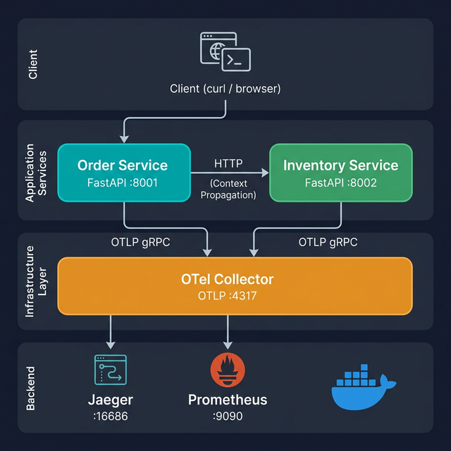

# 실전 마이크로서비스 프로젝트 (final-project)

FastAPI 기반 멀티 서비스 아키텍처에 OpenTelemetry Collector, Jaeger, Prometheus를 통합한 실전 프로젝트입니다.

## 아키텍처



```
                     ┌────────────────┐
  Client ──────────→ │ Order Service  │──────→ Inventory Service
  (curl/browser)     │ (port 8001)    │        (port 8002)
                     └───────┬────────┘        └───────┬────────┘
                             │ OTLP                    │ OTLP
                             └──────────┬──────────────┘
                                        │
                              ┌─────────▼──────────┐
                              │  OTel Collector     │
                              │  (port 4317/4318)   │
                              └────┬───────────┬────┘
                                   │           │
                          ┌────────▼──┐   ┌───▼────────┐
                          │  Jaeger   │   │ Prometheus  │
                          │  (16686)  │   │  (9090)     │
                          └───────────┘   └────────────┘
```

## 실행 방법

```bash
cd examples/final-project
docker compose up --build
```

## 확인

```bash
# 주문 생성
curl -X POST http://localhost:8001/orders \
  -H "Content-Type: application/json" \
  -d '{"user_id": "user-42", "items": [{"product_id": "PROD-001", "quantity": 2}]}'

# 주문 목록 조회
curl http://localhost:8001/orders

# 재고 확인
curl http://localhost:8002/inventory/PROD-001
```

- **Jaeger UI**: http://localhost:16686 — 분산 트레이스 조회
- **Prometheus UI**: http://localhost:9090 — 메트릭 조회

## 종료

```bash
docker compose down
```
